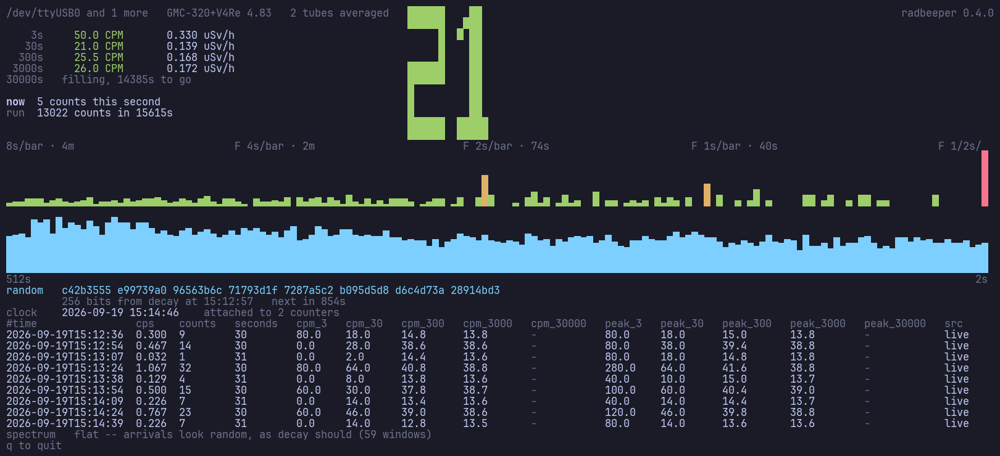
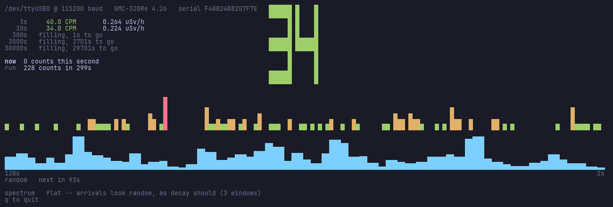
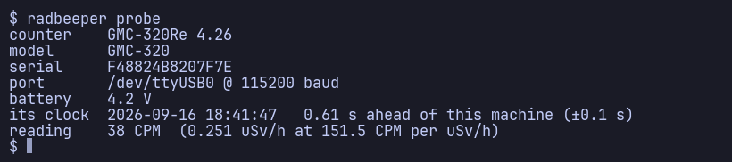
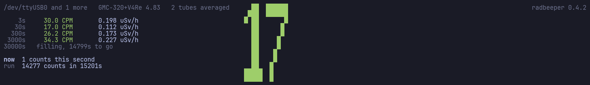
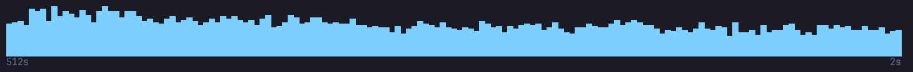
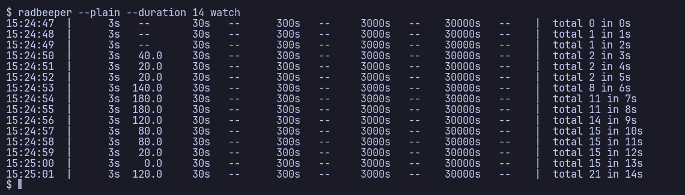
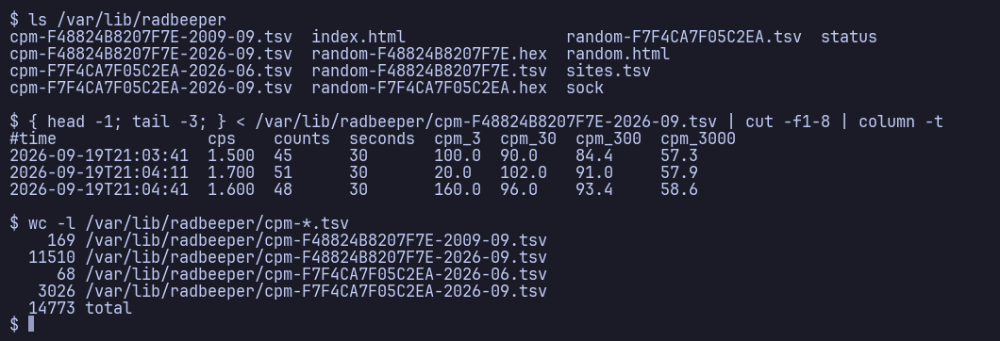
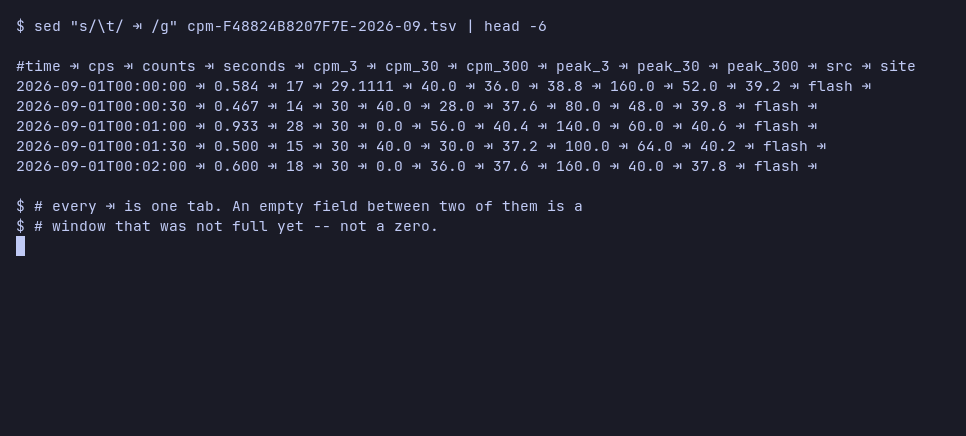
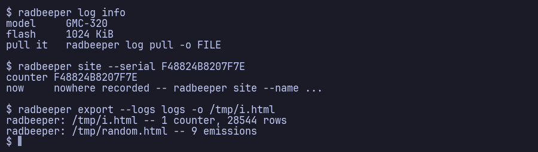

# RadBeeper

**A GQ GMC-320 Plus Geiger–Müller counter on the desk, read from Alpine Linux.**

MIT · `0.1.0` · one file, `python3` and nothing else

**You need a GQ GMC-320 Plus plugged into a USB port.** The counter is a
USB-serial device: plug it into a machine running Alpine — including a VM the
counter is shared into over USB pass-through — switch the counter on, and
RadBeeper finds it, shows what it is counting, pulls the history it recorded
while nobody was watching, and builds a web page out of the result. Fork this
repository, drop your own logs into `logs/`, and a GitHub Action regenerates
that page on every push. [§1](#1-what-you-need) is the full list of what has to
be true; `--source sim` draws the whole monitor with no hardware at all.



**Twenty seconds of it, at ten times speed.** Seconds 300 to 320 of a real
session against the counter these logs came from, one frame a second:



The 3-second window swings between 0 and 80 CPM while the 300-second one moves
between 40.6 and 42.2 — which is the whole argument for keeping four of them.
The 300-second window **arrives two seconds in**, at 302 s, having had nothing
to say until then; the 3000-second one is still counting down and will be for
another forty-five minutes. The bars recolour as individual seconds land, the
spectrum stays flat, and the random line sits where it was until the pool earns
the next one.

## Fast track

```sh
git clone https://github.com/vonglurt/radbeeper.git
cd radbeeper
make install

doas adduser $USER dialout    # once, then log out and back in
```

No packages and nothing to compile — the install is a copy of one stdlib Python
file. The `dialout` line is not optional: the serial node is `root:dialout` and
RadBeeper does not want root.

Then, with the GMC-320 Plus plugged in and switched on:

```sh
radbeeper probe      # find it, confirm it's talking
radbeeper watch      # the monitor — q to quit
```

That is the whole of it. If `probe` finds nothing it says which of four things
went wrong, and they have four different fixes — [§1](#1-what-you-need) is the
list of what has to be true. **No counter yet?**
`radbeeper --source sim --sim-cpm 400 watch` draws the entire monitor against a
synthetic Poisson background, which is a real one: decay is a Poisson process.

<details>
<summary>Everything else it does</summary>

```sh
radbeeper service          # log to disk, a row every 30 seconds
radbeeper backfill         # fill the log's gaps from the counter's own flash
radbeeper random           # 256 bits of hex, out of decay timing
radbeeper site             # where this counter is, and where it has been
radbeeper export           # build index.html and random.html from the logs
radbeeper log pull         # download the raw history to .bin and .csv
```

</details>

---

## 1. What you need

**A GQ GMC-320 Plus, plugged into USB.** That is the hardware, and there is no
substitute for it in software: RadBeeper reads a real tube over a real serial
port, and every number on the screen comes off the wire. Without a counter
plugged in there is nothing to read — though `--source sim` will draw the whole
monitor against a synthetic Poisson background if you want to see it working
before yours arrives.

| | |
|---|---|
| **The counter** | A **GQ GMC-320 Plus**. The 320 is what this was written against and what every screenshot here is. A **GMC-300** works — RadBeeper tries its 57600 baud as well as the 320's 115200 — and a 500 or 600 will be found and read, but its tube is not an M4011, so give it `--cpm-per-usvh` (see [The tube factor](#the-tube-factor)). |
| **The cable** | The **USB cable that came with it**. The socket on the counter is USB-C on a Plus and micro-B on older units, and it is easy to grab a charge-only cable by mistake: one that carries no data leaves you at [Troubleshooting](#troubleshooting) case 1 with nothing plugged in as far as Linux is concerned. |
| **The counter, switched on** | The USB-serial chip inside is powered by the counter, not by the bus. A 320 that is off, or flat, enumerates as nothing. |
| **A kernel with `ch341`** | The 320 Plus presents as a CH340 USB-serial device. `linux-lts` and `linux-rpi` carry the driver; Alpine's `linux-virt` **does not**, which is the single most common reason a counter that is plugged in cannot be found. |
| **Membership of `dialout`** | The serial node is `root:dialout` and RadBeeper does not want root. |

Plug it in, and Linux should say so:

```sh
dmesg | tail -5                       # ch341-uart converter now attached to ttyUSB0
ls -l /dev/ttyUSB*                    # crw-rw---- 1 root dialout ... /dev/ttyUSB0
```

If `/dev/ttyUSB0` is there, you are done — `radbeeper probe` in [§3](#3-find-the-counter)
will identify it. If it is not, [Troubleshooting](#troubleshooting) names the four
things it can be and they have four different fixes.

**USB pass-through counts.** These logs were taken from a 320 Plus shared into a
VM, and the counter cannot tell the difference. What the VM's kernel needs is the
same `ch341` — pass the device through to a guest running `linux-virt` and it will
never appear, no matter how correct the pass-through is.

## 2. Install

No packages, no build. The program is one stdlib Python file and the install is
a copy:

```sh
git clone https://github.com/vonglurt/radbeeper.git
cd radbeeper
make install          # copies to ~/.local/bin/radbeeper
```

`make install` takes `PREFIX=`. On Alpine you need `python3` and nothing more.

There is a native build of the read side too — `cargo install radbeeper`, or a
static binary off the releases page for a machine with no toolchain. It does
`probe`, `cpm` and `watch`; everything that writes the log format stays in the
Python. [§10](#10-the-native-build) is that story.

**Add yourself to `dialout`**, or the serial node will not open:

```sh
doas adduser $USER dialout    # then log out and back in
```

## 3. Find the counter

```sh
radbeeper probe
```



If it finds nothing, the message says which of four things went wrong, because
they have four different fixes — see [Troubleshooting](#troubleshooting).

## 4. Watch it

```sh
radbeeper watch
```

Five panels, top to bottom.

### The number, big

The 30-second CPM in twelve-row block digits, to the right of the serial. 3 s is
too jumpy to read as a headline and 300 s too slow to react to anything you are
doing with your hands, so the middle window is the one that gets the size. The
three horizontal bars are drawn two rows thick — a one-row bar between three-row
uprights reads as a scratch at this scale. It needs no font: the digits are made
from the same block glyph the charts are.

### Four averages, because one is not enough

The counter's own reading is a rolling 60-second count: one number, one time
constant, one question answered. RadBeeper counts the blips itself and keeps
four windows at once, each a factor of ten apart.

| Window | What it is for |
|---|---|
| **3 s** | Watching a source come and go as you move it. Jumpy, and honestly so |
| **30 s** | Reading the room. Settled enough to compare two places |
| **300 s** | A number worth writing down |
| **3000 s** | Fifty minutes. What the background here actually is, once the day's traffic through the room has averaged out |

`--spans` takes the list, so `--spans 1,10,60` is a different set of four
questions. Every window is a column in the log, whatever you choose. The
[animation at the top](#radbeeper) is twenty seconds of exactly this: the
3-second window swinging 0 to 80 while the 300-second one holds 41.

**A window shows nothing until it is full**, and says how long it still needs:



A three-second CPM built from one sample is twenty times noisier than it looks,
and drawing it as though it were settled is how a 25 CPM background reads as 60
and somebody goes hunting for a leak.

### The counts, five rows of them

One column per second, five rows tall. One row of block glyphs has eight levels,
which is enough to say something happened and not enough to say how much; five
rows have forty. Coloured by the same calm / raised / high bands as the numbers
above it — a column is one second, so its count times sixty is the rate it
implies, and a spike that reads red up there reads red down here without anyone
converting in their head.

### The spectrum, where flat is the good answer



Radioactive decay is a Poisson process, and **the power spectrum of a Poisson
process is flat** — white noise, every frequency carrying the same expected
power. A healthy counter watching background therefore produces no shape at all,
and that featureless strip is the useful result: a statement that nothing
periodic is happening.

It earns its place on the other case. A peak means something is arriving on a
schedule, and decay does not have a schedule — mains hum on the tube's supply, a
fan carrying a source past, a loose connector, firmware that batches its
reporting. In the time domain every one of those looks exactly like more counts.

**It accumulates.** One periodogram of a Poisson process is flat in expectation
and violently noisy in fact — every bin an exponential variable whose standard
deviation equals its own mean. Averaging *N* of them divides that scatter by
√*N*, so a real line climbs out of the grass while the grass settles. Windows are
half-overlapped (Welch rather than Bartlett), which gets two averages out of each
window's data instead of one.

**Sigma alone is not a reason to believe anything**, and this is the trap the
panel is most likely to fall into. Sigma is computed for one bin, but the eye
picks the *tallest of 127*, and the largest of many draws is far bigger than any
single draw. Averaged *N* times the largest white bin lands near 1 + ln(B)/*N* —
which at two windows is nearly 4×. So a bin at 4.9×, reading as a confident five
sigma, is very close to what a perfectly healthy counter produces every time you
look. At twenty-eight windows the same arithmetic gives 1.2×, and 4.9× is then
overwhelming. The headline compares against *that*:

```
spectrum   flat -- arrivals look random, as decay should (28 windows)
spectrum   peak at 8s, 9.4x the mean (chance gives 1.2x), 7.2 sigma
```

**Resolution grows with time, because it has to.** Frequency resolution is 1/*T*
for an observation of length *T* — you cannot resolve a 512-second period in 128
seconds of listening. Rather than pick one, RadBeeper runs a **ladder**: 128, 256
and 512 seconds side by side, fed the same samples. The 128 answers after two
minutes; the 512 takes eight and a half but resolves four times as finely, and by
the time it has anything to say it is the better answer. It costs about ten
kilobytes, fixed for the life of the process.

The axis runs from long periods on the left to short on the right (2 s, the
Nyquist limit), and the bars are coloured by significance rather than height.

### The random line

256 bits of hex, out of decay timing, refreshed whenever the pool has earned
them — see [§6](#6-random-numbers-out-of-decay).

### Line output, for a pipe or a log

`--plain` gives one line per second instead of the full-screen monitor, and is
what you get automatically when stdout is not a terminal:

```sh
radbeeper --plain --duration 14 watch
```



### No counter on the desk?

Every command runs against a built-in source, and it is a real one — decay is a
Poisson process, so the simulator draws Poisson samples. Variance equals the
mean, which is exactly the property that makes the 3-second average jump and the
300-second one sit still.

```sh
radbeeper --source sim --sim-cpm 400 watch
```

## 5. Log it to disk

```sh
radbeeper service         # what the boot service runs, in the foreground
```

One row every 30 seconds into a dated file per counter:



| Column | |
|---|---|
| `time` | first and big-endian, so `sort cpm-*.tsv` is chronological with no flags |
| `cps` | counts per **one** second, whatever the row spacing |
| `counts`, `seconds` | so the division can be checked, and a short row is obviously short |
| `cpm_3` … `cpm_3000` | one column per window, empty until that window is full |
| `peak_3` … `peak_3000` | the highest each window reached **since the last row** |
| `src` | `live` if this machine measured it, `flash` if reconstructed |
| `site` | where the counter was at that row's own time |

**The peaks are the point.** A row carrying only the averages as they stood at
the instant it was written would miss a source that came and went between two
rows — which is the one event actually worth having a log for.

Tabs are invisible and that matters here, because an **empty field is not a
zero** — it is a window that was not full yet:



State lives in `/var/log/radbeeper` when that is writable and
`~/.local/share/radbeeper` when it is not. Files rotate by month and by counter
(`cpm-<serial>-YYYY-MM.tsv`), which needs no cron entry and nothing that renames
a file while a service is appending to it.

### As a boot service

Copal's stage 10 installs an OpenRC service and a udev rule. **Dormant is the
normal state**: with no counter plugged in the service writes down why and exits
0 — a stopped service, not a crash loop.

```sh
rc-service radbeeper start        # or just plug the counter in
cat /var/log/radbeeper/status     # what it is doing, and why
```

`radbeeper hotplug` is the other half: it sits in your desktop session and opens
the monitor when a counter appears — at login if one is already there, and on
plug-in at any point after.

## 6. Random numbers out of decay

The moment a nucleus decays is not determined by anything, which makes a counter
the textbook hardware entropy source.

```sh
radbeeper random
```

```
b17c9c60 d5deeb7b 4b102dfc bec14efc b523818b 18d3ada0 582bd912 e61ff856

  256 bits, min-entropy 258 measured, from 448 seconds at 0.68 counts/s
  440 bits is what a Poisson model would have claimed for the same 448 seconds
  spectrum flat -- the source looks like decay
  recorded in /var/log/radbeeper/random-F48824B8207F7E.tsv
```

That second line is the point: on this run the model would have handed over the
same sixty-four characters after 260 seconds and called them 256 bits.

**Three ways this normally goes wrong, and what is done instead.**

*Not from the FFT.* A transform is linear and invertible — it moves information
about, it does not make any. Worse, these coefficients come from a
mean-subtracted, Hann-tapered window, so neighbouring bins are correlated by
construction. Bits pulled from them would look beautiful and carry far less than
they appear to. The entropy is in the counts; the spectrum is a *view* of them.

*Not by XOR and rotation.* Shifting and XOR-ing a block rearranges what is in it.
A block holding twenty bits of entropy holds twenty bits after any amount of
barrel-shifting, while looking more and more convincing. The tool for condensing
a lot of weakly-random data into a little strongly-random data is a cryptographic
hash — SHA-256 is in the standard library and is faster than the shifting.

*Not proven by a flat spectrum.* Flatness is necessary and nowhere near
sufficient: a counter, an LFSR and a square wave at the Nyquist rate all pass it.
It is used as a **health check** — a peak means something periodic is
contaminating the arrivals — and an emission is marked suspect when it fails.
Nor does the spectrum *add* anything: the FFT is a deterministic function of the
same samples, and H∞(f(X)) ≤ H∞(X) for any deterministic f.

**The bits are measured, not modelled — and the model was wrong.** This used to
compute min-entropy as −log₂ max_k P(k) for *Poisson* at the observed rate,
which is the textbook thing to do and is not what the data supports. Across
1,128 recorded samples from a GMC-320Re the variance is **2.54×** the mean;
Poisson requires 1.00. Empty seconds are 36% more common than the model allows
and the tail runs far past it — five counts in a second happens fourteen times
too often. Every pool is over-dispersed on its own, so it is not a mixture of
quiet and busy periods, and high seconds fall next to each other about 1.6× as
often as independence permits. Ground-level coincidences will do that.

Over-dispersion piles the distribution onto its mode, and the mode is exactly
what min-entropy is about, so the model was **claiming 1.15 bits a second where
the samples support 0.62**. What is used now is NIST SP 800-90B's most-common-
value estimator: the observed frequency of the commonest value, pushed to the
far end of its 99% confidence interval so the entropy is a lower bound rather
than a point estimate.

| | Poisson model | measured |
|---|---|---|
| bits per second | 1.150 | **0.618** |
| seconds for 256 bits | 223 | **≈ 415** |

A line therefore arrives about half as often as it used to, and the number on
it is one the data will support. A dead counter never becomes ready, however
long it sits there — and neither does a counter *stuck at exactly one count a
second*, which the Poisson model would have credited with half a bit a second
for having an ordinary-looking mean.

**[There is a page for this.](#9-publish-it)** `radbeeper export` writes
`random.html` beside the index: the counts drawn against the model, the bits
accumulating second by second with the target line across them, what the serial
link's one-second resolution costs, and every emission with the counts behind
it.

**What the interface costs.** `<HEARTBEAT1>>` gives two bytes once per second
and nothing finer, so one sample is one integer and that is the entire raw
material. If the link reported the *time* of each arrival instead, the gap
between two would be exponential, and quantised to a millisecond it would carry
about **10 bits per arrival** — roughly 8 bits a second at this background,
against the 0.62 actually available. GQ's protocol has no such message:
`<GETCPS>>` and the heartbeat both answer with a count, never a timestamp. The
limit is the interface, not the tube.

**Reproducible is not the same as predictable.** The counts behind each line are
written beside it in `random-<serial>.tsv`, so anyone can recompute it and check
it was not invented:

```sh
radbeeper random --check logs/random-F48824B8207F7E.tsv
```

That is an audit trail. It says nothing about the *next* line, which comes from
decays that have not happened yet.

> Treat this as a good physical entropy source, not a certified one. It has not
> been through a statistical test battery, and 256 bits of accounted min-entropy
> is a claim about the model of the source, not a proof about the output.

## 7. Backfill from the counter's own memory

The counter records to its flash whether or not anything is listening. When the
service starts it reads the tail of that flash and fills the log's gaps.

```sh
radbeeper backfill                          # from the counter
radbeeper backfill --image hist.bin --serial ABC123
radbeeper --clock-offset 2180 backfill      # if you have since set its clock
```

- **One row per slot.** A row is identified by the log interval it falls in, so a
  backfill can never write over a live measurement, and a slot with no evidence
  stays absent. Nothing is interpolated across a gap.
- **The counter's second is measured, not assumed.** It is 1.011 of ours on the
  unit this was written against — 39 seconds of drift an hour — so the spacing is
  taken from each pair of timestamps in the recording.
- **The flash is a ring.** On a counter that has been running a while there is no
  unwritten byte in it: the newest sample sits just *before* the write pointer.
  Reading the physical tail would hand back the oldest hours while claiming they
  were the newest.

## 8. Say where it is

```sh
radbeeper site                        # where is it, and where has it been
radbeeper site --name "The garage"    # it moved, from now
```



A reading without a place is half a measurement, and these get carried about — so
the place is a property of a **serial number over time**, appended to `sites.tsv`
and never overwritten. A reading from last Tuesday resolves to where the counter
was last Tuesday.

It records a **name and nothing finer, on purpose**. These logs get published; a
place name is what a reader needs, while a decimal fix is a street address for
whoever is holding the counter. Nothing is assumed either: until you record a
place, the column is empty.

## 9. Publish it

```sh
radbeeper export --logs logs -o index.html
```

One self-contained page: a how-to, summary cards, a log-scale plot of counts per
minute by the hour, a by-day table and the latest rows. **No JavaScript, no web
fonts, no CDN** — the chart is SVG the program draws itself, and the full record
is one link away as the file it already lives in.

**`random.html` is written beside it** whenever there are emissions to account
for, and the index links to it. It is the one claim on the front page a reader
cannot check by looking — 256 bits out of decay — so the audit gets its own
page: the counts drawn against the Poisson model that used to be assumed, the
bits accumulating second by second with the target across them, what the serial
link's one-second resolution costs against timestamped arrivals, and every line
emitted with the counts behind it. `--no-random-page` turns it off.

To put it on the web: **fork this repository, copy your `cpm-*.tsv`,
`random-*.tsv` and `sites.tsv` into `logs/`, and push.**
`.github/workflows/pages.yml` rebuilds both pages and commits them back, so
GitHub Pages serves them with no build step. There is nothing to install in the
workflow — the generator is this same file, which is also why the pages cannot
drift from the log format.

## 10. The native build

```sh
cargo install radbeeper
```

That is the whole install: crates.io builds it and drops the binary in
`~/.cargo/bin/radbeeper`, which cargo already put on your PATH. Nothing is
installed system-wide and nothing needs root.

No toolchain on the machine? Take a static binary from the
[releases](https://github.com/vonglurt/radbeeper/releases) — musl, so one file
runs on Alpine, on Debian and on a Pi with no libc to match:

```sh
v=0.1.0; t=aarch64-unknown-linux-musl        # or x86_64-…, armv7-…, arm-… for a Zero
curl -LO https://github.com/vonglurt/radbeeper/releases/download/v$v/radbeeper-$v-$t.tar.gz
curl -LO https://github.com/vonglurt/radbeeper/releases/download/v$v/SHA256SUMS
sha256sum --check --ignore-missing SHA256SUMS
tar xzf radbeeper-$v-$t.tar.gz
install -m 0755 radbeeper-$v-$t/radbeeper ~/.local/bin/radbeeper
```

Every release is cut from a tag by `.github/workflows/release.yml` — the tag
has to match the version in the manifest or nothing is published, and crates.io
is reached over GitHub's OIDC identity rather than an API key stored here.
[RELEASING.md](RELEASING.md) is the procedure.

`rust/` is a Cargo crate carrying the **read side** natively: `probe`, `cpm`
and the full monitor — the same four time constants, coloured counts chart,
accumulating spectrum ladder and twelve-row digits. One dependency, `libc`,
because a serial port is termios and termios is libc; the FFT, the digits and
the drawing are arithmetic and escape codes.

```sh
make rust            # build it
make rust-install    # cargo install --path rust
make rust-package    # exactly what a publish would upload
```

A full probe against the counter takes **82 ms** and the binary is 400 KB.

Everything that writes the log format — `service`, `backfill`, `export`,
`site`, `random`, `recompute`, `hotplug` — stays in the Python and the binary
says so if you ask it for one. That is not a staging post: the Python runs on a
machine with no toolchain and no network, which is the whole reason it has no
dependencies, and the format is still moving. Two implementations of a file
format is how a file format acquires two dialects.

**Where the speed actually was.** The monitor's budget is one sample a second
and Python used a fraction of a percent of it, so this is about start-up and
footprint rather than throughput. The one genuinely slow path was `backfill`,
and that was an algorithm — fixed in the Python for a 7× win before any of this
was written.

## Troubleshooting

**1. No serial node.** `/dev/ttyUSB*` does not exist. Four causes, in the order
they are worth checking — the first three are the counter's end and cost nothing
to rule out ([§1](#1-what-you-need)):

- **The counter is switched off.** Its USB-serial chip runs off the counter's
  own battery, not the bus, so a flat or powered-down 320 enumerates as nothing.
- **A charge-only USB cable.** Very common, and indistinguishable from a dead
  port until you try another cable. `dmesg` stays silent.
- **Nothing is actually plugged in.** Worth the glance.
- **The running kernel has no USB-serial driver.** Alpine's `linux-virt` ships
  none — no `ch341`, no `usbserial` — so a counter plugged into a VM running it
  can never appear as `/dev/ttyUSB0`, and `dmesg` is silent because nothing ever
  claims the device. `linux-lts` and `linux-rpi` carry the drivers.

`dmesg | tail` separates them: a working cable into a switched-on counter on a
kernel with `ch341` says `ch341-uart converter now attached to ttyUSB0`. Silence
means the device was never seen; a `ch341` line with no node means the driver is
missing.

**2. Permission denied.** The node is `root:dialout`. `doas adduser $USER
dialout`, then log in again.

**3. Something is there but is not a GMC.** A CH340 is a generic USB-serial cable
and plenty of things that are not Geiger counters use one.

**4. The port is busy.** Only one program can read a serial device sensibly — two
readers share the bytes between them and neither is told — so RadBeeper locks the
port. `doas rc-service radbeeper stop` hands it over. The service waits on the
lock rather than giving up, so the log picks up again by itself when you close
the monitor.

## Reference

### Commands

| | |
|---|---|
| `probe` | find the counter and say what it is |
| `watch` | the monitor; `--plain` for line output |
| `cpm` | the counter's own CPM once, for a script |
| `service` | monitor and log; dormant when there is nothing to read |
| `hotplug` | sit in the session, open the monitor on plug-in |
| `backfill` | fill the log's gaps from the counter's flash |
| `random` | 256 bits from decay timing, with the accounting for it |
| `recompute` | fill long-window columns in existing logs from their own counts |
| `site` | where a counter is, and where it has been |
| `export` | build `index.html` from the logs |
| `log info` / `log pull` | how much history flash, and download it |

Options: `--source sim`, `--sim-cpm`, `--seed`, `--spans 3,30,300`,
`--cpm-per-usvh`, `--log-every`, `--duration`, `--clock-offset`,
`--backfill-bytes`, `--max-gap`, `--entropy-bits`, `--device`, `--baud`.

### The tube factor

µSv/h is CPM divided by a number that belongs to the **tube**, not the counter.
The default, 151.5, is the M4011 in a GMC-320. A 500 with a different tube needs a
different number, which is why it is `--cpm-per-usvh` and not a constant buried in
the arithmetic.

### Protocol

Commands are ASCII `<NAME>>`; replies are raw bytes with no framing, so every read
asks for an exact count and times out rather than blocking.

| Command | Reply |
|---|---|
| `<GETVER>>` | 14 bytes, e.g. `GMC-320Re 4.26` |
| `<GETSERIAL>>` | 7 bytes |
| `<GETCPM>>` | 2 bytes, big-endian |
| `<GETCPS>>` | 2 bytes, mask `0x3FFF` |
| `<HEARTBEAT1>>` | then 2 bytes every second until `<HEARTBEAT0>>` |
| `<GETVOLT>>` | 1 byte, tenths of a volt |
| `<GETDATETIME>>` | 7 bytes |
| `<SPIR[addr][len]>>` | `len` bytes of history flash |

Baud is 115200 on the 320 and 57600 on the 300; RadBeeper tries both.

There is no `pyserial`. Alpine packages it, but this runs on a Pi Zero with 512 MB
and on a fresh install with no network, and a serial port is thirty lines of
`termios`.

**Two corrections to GQ's published history format**, both measured against a full
1 MiB image from a GMC-320Re 4.26. The datetime record is **nine** bytes, not ten.
And `55 AA 01` is a **three-byte marker carrying no payload**, not a two-byte
count: reading it as one invented 1,701 readings between 256 and 21,930 counts per
second on a tube that saturates three orders of magnitude below that. `log pull`
writes the raw flash image before decoding it, which is why both were fixable
against data already on disk.

### Speed

The monitor's budget is one sample a second and it uses a fraction of a percent of
it — a 512-point FFT is 0.5 ms, once every few minutes. The one place that ever
mattered was `backfill`, and it turned out to be an algorithm rather than a
language: each window re-summed its own tail on every sample, O(samples × window),
which cost 16.5 s to turn 850,000 samples into 28,000 rows — 765 million
additions. Keeping a running sum and subtracting what falls out the back is O(1)
per sample. **Same output, byte for byte, in 2.3 s instead of 16.5.**

### Tests

```sh
make check        # syntax, then 178 tests: no hardware, no network
```

`tests/fake_gmc.py` serves a fake GMC-320 on a pseudo-terminal, so the serial path
— termios, exact-length reads, command framing, the heartbeat stream, the chunked
history download — is tested without a counter on the desk. It also runs
standalone:

```sh
python3 tests/fake_gmc.py --cpm 400
radbeeper -d /dev/pts/N watch
```

The full-screen monitor is tested too, on a 132×46 pty, because it only runs when
stdout is a terminal and two bugs shipped in the part nothing was executing.

---

MIT — Copyright (c) 2026 Paul Richeson

### The screenshots

Every image in `docs/screenshots` is a recording, not a picture. `tools/record.py`
runs the program under a pseudo-terminal, logs every byte it writes with a
timestamp, and replays that through a small VT emulator into a grid of cells,
which is then drawn with one rectangle per block glyph and one glyph per
character. `tools/promo.py` drives it.

```sh
make promo                 # all of them: needs the counter plugged in, ~7 min
make promo-fast            # the same, reusing the last monitor recording
make promo SHOTS=probe     # just one
```

Two consequences worth having. **A screenshot cannot claim something the
program does not do** — the log-format shot found that busybox `sed` ignores
`\x` escapes, because the recording showed the escape instead of the arrow.
And **the monitor shots are one session**: the hero, the filling shot, the
spectrum strip and the twenty-second animation are four moments of the same
380-second run against the counter, so the numbers in them agree with each
other because they are the same numbers.

`tools/record.py inventory <cast>` prints the escape sequences a recording
actually contains. The emulator implements that list and nothing else, so a
future ncurses emitting something new shows up there rather than as a quietly
wrong pixel.

**And it is tested**, in `tests/test_record.py`, because a bug in a terminal
emulator does not raise an exception — it publishes a picture of something the
program never drew. One did: on a screen busy enough for ncurses to decide
scrolling was cheaper than redrawing, it emits `CSI T` inside a scroll region,
and an emulator that ignores `DECSTBM` puts every row below the scroll point in
the wrong place. It drew the random line five rows up, on top of the spectrum.
The program was correct; the picture of it was not.
