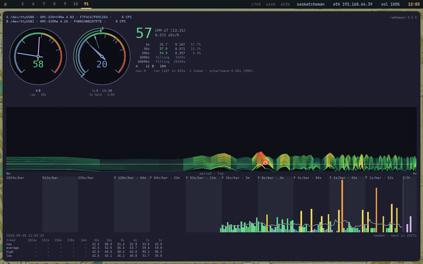

<!-- SPDX-License-Identifier: MIT — Copyright (c) 2026 Paul Richeson -->

# The drum spectrogram, read as a landscape

[← The status line](reading-the-status-line.md) · [↑ Reading the window](reading-the-window.md) · [The counts →](reading-the-counts.md)

**The striped panel is built like a relief map, and reads like one.**

The panel answers one question: is anything reaching the counter on a
schedule? Decay has no rhythm, so a healthy counter shows no pattern. A
fan, mains noise or a fault shows a stripe. **[Reading the drum
spectrogram](reading-the-drum-spectrogram.md)** is the guide to telling
chance from something real; this page is about how the picture is built.

## Every line is a profile

Each line across the panel is one row: a spectrum of the last eight and a
half minutes of counts, with the period on the horizontal axis (slow
rhythms to the left, fast to the right) and the power at each period as
**height above the line**. Think of it as a cross-section through terrain:
flat where the counts have no rhythm, a hill where they have one.

## The rows stack into terrain

A new row is drawn every eight seconds at the bottom, just above the
counts, and each older row is two pixels further up. Ninety-six rows are
kept, so the top of the paper is about thirteen minutes older than the
bottom. They are painted back to front, oldest first, each one hiding what
is behind it, so the panel is the terrain seen from in front and slightly
above. Something that repeats at one period for a long time raises the same
spot in row after row, and that reads as **a ridge running up the paper**.
A patch of luck raises a few rows and reads as a knoll that drifts up and
off the top.

## Height is relative; colour is not

The two say different things, and the difference is the point.

**Height** is the power on a logarithmic scale against the loudest thing on
the paper, at most twenty-four pixels (twelve rows). The loudest thing is
always the top, so nothing is ever cut off, and the vertical exaggeration
adjusts itself: when a loud peak scrolls off the top, the rest grows to
fill the room it left. Read height for shape and for comparison within the
panel.

**Colour** is a *hypsometric tint*: the elevation bands of a topographic
map, where lowland is green, foothills yellow, highland brown and red, and
summits white. Here the elevations are powers, fixed against **the luck
line**, the power that chance reaches on its own, and they never rescale:

| Power | Terrain | Tint | Pen |
|---|---|---|---|
| nothing | sea | teal, hardly there | 0.6 px |
| 1, flat | lowland | sea green | 1.1 px |
| 2 to 5 | foothills | green to lime | 1.5 to 1.9 px |
| 8, the luck line | the tree line | yellow going orange | 2.2 px |
| over it | highland | orange to red | 2.3 px, glowing |
| 12 and over | summit | white, by way of pink | 2.4 px, glowing |

Yellow is the luck line on every paper, whatever is loudest, so **the colour
is the reading**: anything orange or hotter is more than chance manages,
anywhere, any time. The pen also widens with the same figure, and above the
luck line it glows, a wider stroke of the same colour under the line, so
the hot ground is unmistakable at a glance.

## Brightness is the weather

Each whole row is drawn as bright as the counter was counting while it was
made, against the long average: full brightness at twice the usual rate,
faint at half. So the paper says when the rate rose as well as at what
period. A row that is hot from edge to edge, and bright, is not a rhythm;
the counts came in a rush for those minutes.

## Summits are marked

Where a row stands over both its neighbours and over the luck line, a dot
marks the top of the peak, in the pen's colour. The one highest summit on
the whole paper wears a white ring, the only pure white on it.

## The front row is the contour of record

The line the newest row is drawn on carries the spectrum itself: the same
profile made from hours of counts rather than eight minutes, in the same
pen on the same axis. It is steady where the rows are restless, and a bump
in it sits exactly under the same bump in the rows above. For slow rhythms,
on the left, trust it over the rows.

## The axis under the ground

The caption at the left of each stretch is the period it begins at. The
left tenth of the panel is one to nine hours, the next seventh five minutes
to an hour, and the rest eight and a half minutes down to a few seconds.
The axis grows as the longer windows fill: it reaches 8 minutes first,
1 hour 8 after an hour, 9 hours 6 after nine.

## What the clip shows

The clip at the top is the paper filling from empty after a service
restart, one frame per row, played at four rows a second. Nothing is drawn
for the first eight and a half minutes: a row needs its full 512 seconds of
counts before it can be made, and the window shows the window filling
instead. Then a row arrives every eight seconds, and the paper is full end
to end after ninety-six of them, twenty-one minutes in. The counter in it
is in an ordinary room, and the paper is green from edge to edge with warm
patches that come and go: the good answer.

**[The drum spectrogram](the-drum-spectrogram.md)** is the lab report: how a
row is computed, the measurements behind the luck line, and why it is drawn
the way it is.

---

[← The status line](reading-the-status-line.md) · [↑ Reading the window](reading-the-window.md) · [The counts →](reading-the-counts.md)
