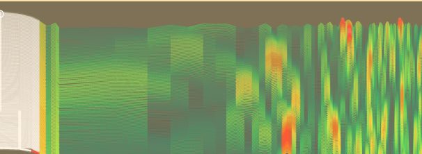
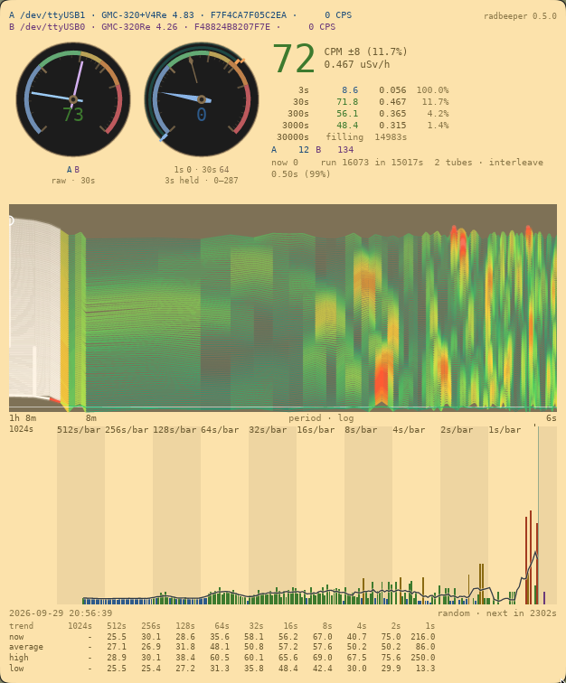
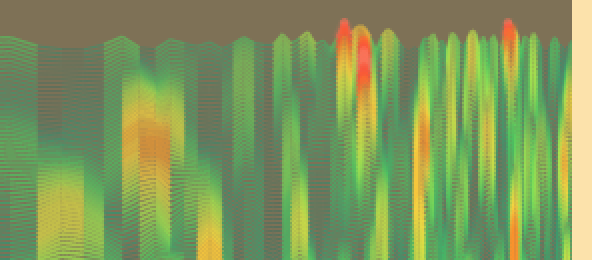

<!-- SPDX-License-Identifier: MIT — Copyright (c) 2026 Paul Richeson -->

# Reading the drum spectrogram

**The striped panel in the middle of the RadBeeper window, and how to read
it. It answers one question: is anything reaching the counter on a
schedule?**

---

## What it is for

Radioactive decay has no rhythm. Counts arrive at random, and a healthy
counter in an ordinary room shows that: no pattern at all.

If something *does* arrive on a schedule, it is not decay. It is a fan
carrying something past the tube every few seconds, electrical noise on the
counter's supply, or the counter itself batching its reports. In the big
number on the screen all of those look exactly like more radiation. Here
they look like a stripe.

---

## What you are looking at

**It is a paper chart, like the one a seismograph draws.** Every eight
seconds a new line is drawn at the bottom, just above the counts, and all
the older lines move up to make room. Each line is made from the last eight
and a half minutes of counts, and the line at the top is about twelve
minutes older than the one at the bottom.

**The very bottom line** is the same measurement averaged over hours. It is
drawn in the same colours as the lines above it, in the same places, so a
bump in it sits directly under the same bump in the lines above. It is
steadier than they are, and slower to change.

**Left to right is how often.** Slow rhythms are on the left and fast ones on
the right. The labels under the panel say where you are: in the picture,
the left edge is once an hour, `8m` is once every eight and a half minutes,
and the right edge is once every six seconds.

**Up is more.** Where a line rises, more of the counts arrived at that
rhythm.

**The colour and the thickness say how much.** The pen gets hotter and wider
as the signal gets stronger:

| You see | It means |
|---|---|
| Thin green lines | The ordinary background. Nothing there. |
| Lime to yellow | Stronger, but still within what chance does on its own. |
| Orange and red, thick and glowing | More than chance usually manages. |
| White | Much more. |
| A dot on a line | The top of a peak. |
| A white ring | The single strongest peak on the whole chart. |

**How bright a whole line is says how busy the counter was.** A line drawn
while the counter was counting twice its usual rate is at full brightness.
One drawn while it was counting half is faint.

---

## How to read it

### Mostly green: all is well

This is a counter in an ordinary room. The chart is green from edge to edge,
with a few warm patches that come and go. **This is the good answer.**

### A warm patch that comes and goes: chance

Random counts make short-lived patterns by luck, and the chart shows them.
A patch like this one, ten lines tall, is what luck looks like. It will
drift up the chart and off the top, and another will turn up somewhere
else.

**The rule of thumb: a patch shorter than about a third of the chart is
chance.** Measured on simulated background, chance patches are usually five
lines tall, almost never more than thirteen, and were never seen to reach
half the chart. A patch that stays hot for longer than that is worth a
look.

### A stripe from top to bottom: something real

A hot stripe that runs **straight up the chart, in the same place, and
stays there** as new lines arrive is a rhythm that is really present. Read
where it is against the labels under the panel to see how often it repeats.

Then look for the cause near the counter: something that turns, switches or
pulses at that interval.

### A whole line lit up, side to side: the counts came in a rush

If an entire line is hot from the left edge to the right, nothing is
arriving on a schedule. For those minutes the counts came less evenly than
usual: in a rush, or in clumps. That is worth a look at the counter itself
as much as at the room.

---

## Three things to keep in mind

**The left side moves slowly.** Slow rhythms need a long time to measure, so
the lines on the left hardly change from one to the next and run down the
chart as parallel streaks. A streak there is not proof of anything. For slow
rhythms, trust the bottom line, which averages over hours.

**It only sees strong rhythms.** A faint one is invisible here. The bottom
line is what finds those, by averaging for a long time.

**It never goes off the scale.** Whatever is strongest on the chart sets the
top, and everything else is drawn against it. The colours do not rescale, so
yellow always means the same thing.

---

## Where it is

Run `radbeeper-gui` with a counter attached. The chart is drawn when the
window is at least 640 pixels tall; in a smaller window the counts and the
bars keep the space.

---

## The details

**[The drum spectrogram](the-drum-spectrogram.md)** is the lab report: how a
line is computed, how much time the chart holds, the measurements behind the
rule of thumb above, and why it is drawn the way it is.

[← back to the overview](../README.md)
