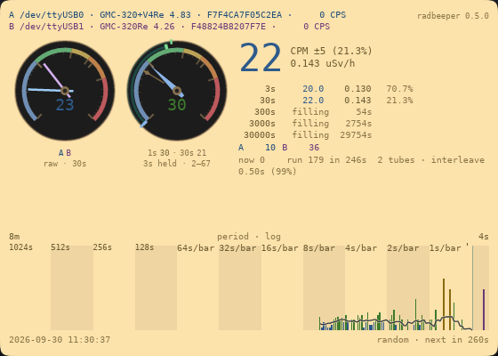

<!-- SPDX-License-Identifier: MIT — Copyright (c) 2026 Paul Richeson -->

# The table

[← The random line](reading-the-random-line.md) · [↑ Reading the window](reading-the-window.md)

**The bottom of the window: the trend line in numbers.**



```
trend   1024s   512s   256s   128s   64s   32s   16s    8s    4s    2s    1s
now         -      -      -      -     -  28.7  25.4  21.0  26.8  33.9  24.0
average     -      -      -      -     -  36.7  25.6  22.5  33.9  28.4  29.2
high        -      -      -      -     -  44.9  28.1  27.3  47.5  37.6  60.0
low         -      -      -      -     -  28.7  23.6  18.8  20.3  16.3  10.0
```

One column per panel of the counts, in CPM. **now** is where the trend line
is at the newest bar of that panel; **average** is its mean over the whole
panel; **high** and **low** are its extremes there. A dash is a panel that
has not filled yet.

It is the same information as the strip, for reading off rather than
looking at: the table is what to quote, the strip is what to watch.

**In a small window the table comes first.** The window fits whatever
space it is given; as it runs out of height the drum goes first, then the
counts, and the table stays. The window follows the desktop's light or dark
theme.

---

[← The random line](reading-the-random-line.md) · [↑ Reading the window](reading-the-window.md)
