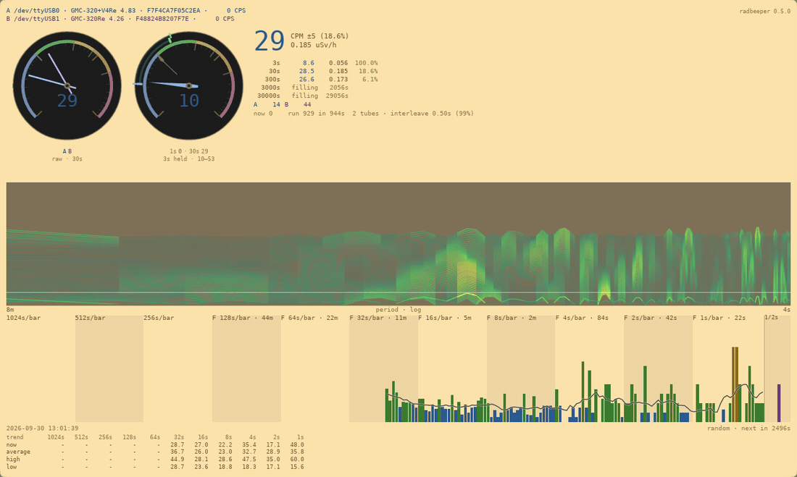

<!-- SPDX-License-Identifier: MIT — Copyright (c) 2026 Paul Richeson -->

# Reading the window

**What every number on the RadBeeper window means, feature by feature.**

The window is `radbeeper-gui`. It opens no serial port; it reads the same
stream the service publishes, so what it shows is what the log has. From the
top down, one page each:

1. **[The counters and the dials](reading-the-counters.md)** — which counters are connected, what each counted last second, and the bands on the dials
2. **[The big number and the five averages](reading-the-averages.md)** — the same reading over five windows, and how well each window knows its number
3. **[The status line](reading-the-status-line.md)** — this second's count, the run so far, and how two counters share the second
4. **[The drum spectrogram, read as a landscape](reading-the-drum-as-a-landscape.md)** — height, tint and brightness: the striped panel as a relief map, and the paper filling from empty
5. **[The counts](reading-the-counts.md)** — a bar a second, older bars packed coarser, the trend line and the pointer
6. **[The random line](reading-the-random-line.md)** — the newest bits drawn from decay timing, and which counter earned them
7. **[The table](reading-the-table.md)** — the trend line in numbers, and where the table goes in a small window

The window follows the desktop's light or dark theme, and fits whatever
space it is given: in a small window the table goes first and the charts
last.

[← back to the overview](../README.md)
