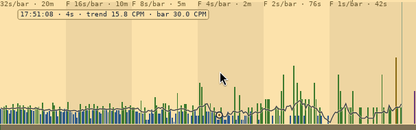

<!-- SPDX-License-Identifier: MIT — Copyright (c) 2026 Paul Richeson -->

# The drum spectrogram

**A short-time Fourier transform of a Geiger counter, kept a row at a time
and laid down the paper like a seismograph's, by a pen that is hotter and
wider for what is louder: what the accumulated spectrum throws away, which
is when.**

*A lab report in the IEEE style, on the trail `radbeeper-gui` draws under its
spectrum. Written against radbeeper 0.5.0, 29 September 2026, and rewritten
the same day as the thing it describes was (§X). The technique is described
first and named last, in [§IX](#ix-naming); the short answer is that
this document calls it a **drum spectrogram**, and its pen a **thermal
pen**. Every figure in it was measured on the day, either on the bench's two
counters or on simulated counts, and says which.*


---

## Abstract

RadBeeper already looks for anything arriving on a schedule, with a power
spectrum averaged over every window it has ever taken. Averaging is how a
faint period is found and how its *time* is lost: a line that was present for
ten minutes an hour ago and one that has been present all along come out as
the same bar. This report describes the view that was added under it. A
periodogram of the last 300 seconds is taken every 10 seconds and kept as a
row; to its left each row is carried on, by the spectrum's longer windows,
as far as the axis goes. The newest 48 rows are drawn as line traces, one
under another, the full width of the panel and on the spectrum's own axis.
The paper holds **7 minutes 50 seconds of rows, made from 12 minutes 50
seconds of counts** at periods up to five minutes, and from as much as nine
hours beyond them. Rows are held against the average of the last 3000
seconds, so their heights can be compared, and drawn by their logarithm
against the loudest thing in view, so one loud period cannot flatten the
rest and nothing is ever off the scale. The pen says how loud in its colour,
its width and its glow; the whole trace is as bright as the room counted;
and a row's peaks are marked. A row on its own is noise by construction. The
report gives the arithmetic of a row, the flow from the counter's serial
port to the pixel, the measured length of the ridges that chance draws, and
what the view can and cannot find.

**Index terms** -- short-time Fourier transform, spectrogram, ridgeline
plot, helicorder, periodogram, Poisson process, automatic gain, colour
scale, radiation monitoring.

---

## I. Introduction

### A. The problem

Radioactive decay is a Poisson process and the power spectrum of a Poisson
process is flat. [The spectrum](the-spectrum.md) uses that: it averages
periodograms, the scatter falls as 1/√*N*, and anything periodic -- mains
hum on a tube's supply, a fan carrying a source past, firmware that batches
its reports -- climbs out of a floor that is settling under it.

The average has one number for each period. It cannot say whether the
period is there *now*, whether it came and went, or whether it began when
somebody switched something on. Those are the questions asked of a line
once it has been seen.

### B. What was asked for

A paper-feed plot, of the kind a drum seismograph makes: many traces laid
one under another, each a little later than the last, so that something
which persists is a shape running down the page. It was to be part of the
spectrum it comes from and not a display of its own -- the same axis, the
same ground, no frame and no words around it -- with each row five minutes
long, coloured by how loud it is, and scaled so that detail is shown
whatever is loudest.

---

## II. One row

A row is a periodogram of the last `W` = 300 seconds of counts per second,
summed across the tubes. In order:

| Step | What is done | Why |
|---|---|---|
| 1 | Take the newest 300 seconds, *x*₀ … *x*₂₉₉ | five minutes, which is the stretch somebody asks about |
| 2 | Subtract their mean | the DC term is the count rate, which every other number on the panel gives |
| 3 | Multiply by a Hann taper, *w*ᵢ = ½ − ½ cos(2π*i*/299) | a period that does not divide the window would otherwise leak into every bin [2] |
| 4 | Transform: *X*ₖ = Σ *x*ᵢ *w*ᵢ e^(−2π*ik*/300) | see below |
| 5 | Take \|*X*ₖ\|² for *k* = 1 … 149 | bin *k* is the period 300/*k* seconds; *k* = 0 is DC and *k* = 150 is left out |
| 6 | Divide by *r* · Σ *w*ᵢ² | *r* is the average rate of the last 3000 seconds; see §II.B |

### A. Three hundred is not a power of two

The transform the spectrum uses is radix-2 and wants 256 or 512. Padding 300
seconds to 512 with noughts would give bins that are not three hundred
seconds' and are not independent of their neighbours, which is what the luck
line counts on. So step 4 is summed as it is written, from a table of one
turn of the circle: 149 bins of 300 terms, **44,700 steps a row**, once
every ten seconds. `analysis::powers` uses the fast transform where the
length allows it, and a test holds the two to the same answer at 256.

### B. The normaliser is the long average

The first form divided a row by its own mean, which makes every row flat at
1.0 and so makes every row the same height: five minutes in which the room
counted twice as much were drawn no taller than the five before.

Counts that arrive by chance at *r* a second have a variance of *r*, so they
put *r* · Σ *w*ᵢ² in every bin, on average. The rate therefore says what
flat *should* be. Taken over the last 3000 seconds -- the fourth of the
panel's five averages -- it says so without being moved much by the five
minutes being measured. Against it a row reads 1.0 when the room is as it
has been, and the whole of it stands higher when the room is not.

A test runs fifty minutes at 0.9 counts a second and then five at 1.8. The
rows before the change average 1.0; the row after it reads about 2; the same
row divided by its own mean reads 1.0.

The price is that a row's level now wanders by chance: over 400,000
simulated seconds the mean of a row had a standard deviation of 0.15.

### C. A row is joined from several windows

A window holds no period longer than itself, so a row of 300 seconds stops
at five minutes, and on a panel whose axis ran to an hour the traces had the
right-hand three fifths of it and the left was bare. The periods beyond are
in longer windows, and the spectrum already has three: 512, 4096 and 32768
seconds. `analysis::Trail` takes a row from all of them, every one ending at
the same second:

| Window | Bins it gives | Their periods | Steps a row |
|---|---|---|---|
| 300 s | 149, which is all it has | 300 s to 2.013 s | 44,700 |
| 512 s | 1 | 512 s | 512 |
| 4096 s | 7 | 4096 s to 585 s | 28,672 |
| 32768 s | 7 | 32768 s to 4681 s | 229,376 |

From each window after the first, only the bins that are longer than the
window before it could hold. That is 164 bins in a row, and the fifteen on
the left are all there is out there: a window has one bin at its own length,
one at half of it, one at a third.

Only the bins that are asked for are worked out, by the sum; and only the
rows that are on show. `add` keeps the second and nothing else, and `rows`
works out what is missing, so a window that is handed hours of history when
it attaches works out forty-eight rows at the end and not three thousand on
the way.

A window that has not yet its seconds is left out of the row, and the trace
begins where there is something to draw.

### D. The parameters

| | Value | In seconds |
|---|---|---|
| Window, `W` | 300 samples | 5 m |
| Hop, `H` | 10 samples | 10 s |
| Depth, `D` | 48 rows | — |
| Bins of the window | 149 | periods of 300 s down to 2.013 s |
| Spacing of the bins | 1/300 Hz | — |
| Bins joined on from longer windows | 15 | 512 s to 32768 s |
| Overlap of a row with the one before | 290 of 300 seconds | 96.7% |
| The normaliser's average | 3000 samples | 50 m |

---

## III. The flow

This is what happens to a count between the tube and the screen. Each box
is one place in the code.

```text
 two GMC-320s                     each reports the counts of its last second
      │  serial, once a second
      ▼
 radbeeper service                holds the ports, logs, and serves the stream
      │  unix socket, a line a sample: who, when, counts
      ▼
 feed thread (gui)                one per window; replays what the service
      │                           holds when it attaches
      │  samples are summed by WHOLE WALL-CLOCK SECOND across the tubes
      │  when the second closes: sec_sum
      ▼
 ┌─────────────────────────────┐
 │ Trail::add(sec_sum)         │  analysis.rs
 │  ring of the last 33,248 s  │  the longest window and the rows on show
 └─────────────────────────────┘
      │
      │  once a second, when a snapshot is made:
      │  has a whole ten seconds gone by since the newest row?
      ├── no ──► the rows there were
      ▼
 ┌─────────────────────────────┐
 │ Trail::rows()               │  the 48 that end at the last whole ten
 │                             │  seconds and the 47 tens before it
 │  a row that was kept: kept  │
 │  a row that is new:         │
 │    r = mean of the 3000 s   │  the rate, before the row's end
 │    for 32768, 4096, 512,    │  each window that has its seconds,
 │        300:                 │  the longest first
 │      mean off · Hann        │  §II, steps 2 and 3
 │      |X|² of its bins       │  steps 4 and 5, §II.C
 │      ÷ (r · Σw²)            │  step 6
 │    joined, longest first    │
 └─────────────────────────────┘
      │  rows (shared, remade only when a row is due),
      │  the second the newest ends at · seconds since
      ▼
 Snapshot, once a second          the same message that carries the rest
      │
      ▼
 Chart::draw                      one canvas: dials, counts, spectrum, trail
      │  is (made, age, axis) what was drawn last time?
      ├── yes ──► the kept drawing, as it is
      └── no  ──► Chart::trail
                    loudest = the largest power on the paper
                    the ground, shaded
                    rows NEWEST FIRST, which is furthest away:
                       line  = the spectrum's floor + (index + age/10) × 4 px
                       x     = the spectrum's own axis, by period
                       y     = line − gain(power, loudest) × 24 px: up is more
                       ground painted back in under the trace
                       trace stroked by the thermal pen, as bright as
                         the row's level; a dot on each peak
                    a ring round the loudest peak on the paper
      then Chart::spectrum, over it: bars standing on the newest row's line
```

Three things about it are worth saying.

**The rows are shared, not sent.** A snapshot goes to the interface every
second and the rows change every tenth, so they sit behind a reference
count and are rebuilt only when a row is due.

**The drawing is kept.** The canvas is redrawn twelve times a second, because
the needles on the dials move that often. The trail is some five thousand
line segments and changes once a second, so it is drawn into a
`canvas::Cache` that is cleared only when the newest row, its age or the
axis changes. The software renderer the window uses in a virtual machine
notices the difference.

**A window that attaches late is not behind.** The service replays what it
holds, the feed gives every second of it to `add`, and the paper is full
by the time the first live sample arrives.

---

## IV. How much time it captures

The question has four answers, and they are different numbers. They are
of the 300-second window, which is five sixths of the panel; the stretches
to its left are after the table.

| What is meant | Arithmetic | Time |
|---|---|---|
| **One row** | `W` | **300 s = 5 m** |
| **The rows on the paper**, top to bottom | (`D` − 1) × `H` = 47 × 10 | **470 s = 7 m 50 s** |
| … as the oldest leaves it | `D` × `H` = 48 × 10 | 480 s = 8 m |
| **The counts in the picture** | `W` + (`D` − 1) × `H` = 300 + 470 | **770 s = 12 m 50 s** |
| The counts behind the normaliser | 3000 | 50 m |

The row at the foot of the paper was taken 7 minutes 50 seconds ago. But it
was itself made from the 300 seconds before that, so the oldest count with
any say in a trace arrived nearly thirteen minutes ago; and the level every
trace is held against looks back fifty.

### The long periods, on the left

| Stretch | Its window | A row is | Counts in the picture |
|---|---|---|---|
| 5 m to 1 h 8 m | 4096 s | 1 h 8 m 16 s | 4566 s = 1 h 16 m |
| 1 h 8 m to 9 h 6 m | 32768 s | 9 h 6 m 8 s | 33,238 s = 9 h 14 m |

So the whole picture, when every window has answered, is made from **9
hours 14 minutes of counts**. But the rows there are not forty-eight looks
at anything: see §V.D.

### What that is worth

| | Arithmetic | |
|---|---|---|
| Windows that share no seconds | 770 / 300 | 2.6 |
| Looks that are nearly independent, at half overlap | 470 / 150 + 1 | 4.1 |
| Counts in one row, at the bench's 0.9 a second | 0.9 × 300 | about 270 |
| Counts in the whole picture | 0.9 × 770 | about 690 |
| Until the first row, from a cold start | `W` | 5 m |
| Until the paper is full | `W` + (`D` − 1) × `H` | 12 m 50 s |
| Arithmetic | 44,700 steps every 10 s | — |

Forty-eight rows are therefore **four measurements, not forty-eight**. The
other forty-four are those four seen again as they slide past, which is what
makes a ridge a line rather than four dots, and is also what §V is about.

The taper matters to the first figure. A Hann window weighs the middle of
its 300 seconds fully and the two ends hardly at all, so a row answers
mostly for the two and a half minutes at its centre.

### Against the spectrum it is drawn under

| | Window | Reach | Keeps the time? |
|---|---|---|---|
| Trail | 300 s | 12 m 50 s | yes, to 10 s |
| Spectrum, short | 512 s | everything since it started | no |
| Spectrum, middle | 4096 s | the same | no |
| Spectrum, long | 32768 s | the same | no |

---

## V. Reading it

### A. One spike means nothing

A single bin of a single periodogram of noise is an exponential variable,
and the tallest of 164 stands about ln 164 above the mean. `chance_max`
puts the line at **7.59** for one row of 164 bins, and at 7.50 for the 149
of the 300-second window alone, which is what the measurements below were
made with. A trace is inked in the warning's colour from there up.

### B. Nor does a short ridge

A row shares 290 of its 300 seconds with the row before. A spike that luck
put in one is in its neighbours too, so chance draws ridges of its own. How
long was measured, on simulated Poisson counts with nothing periodic in
them, 400,000 seconds at each of two rates, with the rows held against the
long average as the window holds them:

| Rate | Runs over the line | Median | 90% within | 99% within | Longest |
|---|---|---|---|---|---|
| 0.45 counts/s | 677 | 5 rows | 9 rows | 13 rows | 17 rows |
| 0.90 counts/s | 642 | 5 rows | 9 rows | 12 rows | 22 rows |

And of papers of 48 rows, how many held a run that long in any bin:

| A run of at least | 8 rows | 15 rows | 24 rows |
|---|---|---|---|
| Share of papers, 0.45/s | 15% | 0.24% | none |
| Share of papers, 0.90/s | 13% | 0.12% | none |

So: a coloured streak **under fifteen rows** -- half a window, a third of
the paper -- is what noise looks like here. One of fifteen or more is luck's
about twice in a thousand papers. One that runs **half the paper**, 24 rows,
was not seen in 800,000 seconds. `Waterfall::chance_rows` is the fifteen.

These are a little longer than the first form's, which was measured at 256
seconds and 8 with rows held against themselves: there the longest of 981
runs was 16, and a test holds that arrangement to it. The long average lets
a whole row stand a little high by chance, and a row that stands high
carries its spikes over the line with it.

### C. What it finds

A source with a period of 10 seconds was added to a background of 0.9 counts
a second, 200,000 seconds at each strength:

| Source, as a share of background | Its bin reads | Rows over the line | Longest run in a paper, median |
|---|---|---|---|
| 50% | 8.3 | 54% | 20 rows |
| 20% | 2.7 | 3% | none |
| 10% | 1.4 | none | none |

This is the honest limit. The trail sees a period that is **strong**, and
says when it was there. A faint one it does not see at all: at a fifth of
background the bin reads 2.7 and the line is at 7.5. Finding the faint one
is what averaging is for, and the spectrum above it does that; the two are
not rivals.

### D. The left of the paper is texture

A row of the 4096-second window shares 4086 of its seconds with the row
before it, and one of the 32768-second window shares all but ten. Two rows
are as good as independent when they are half a window apart, which is 205
rows for the first and 1638 for the second, and the paper holds 48.

So out there the traces are very nearly the same trace, forty-eight times,
and they run down the paper as parallel lines: whatever one row reads, they
all read. **A coloured streak on the left that runs the whole paper is one
draw of chance and not forty-eight**, and the fifteen-row rule is no use to
it. What is to be believed about a long period is the averaged spectrum
above, where a window has been taken many times. The trail says how that
bin is moving, slowly, and no more.

---

## VI. The drawing

There is a ground, a line for each row, a height, a pen and an order.

**The ground is shaded**, the panel's own colour half way to black, from the
floor of the counts to the foot of the canvas and the full width. On paper a
pen can only be darker than its ground, and the loudest thing drawn was the
least like light. Against a shaded ground a bright line is bright, and what
is faint falls back into it.

**Up is more.** A trace rises from its line for what is louder, as a bar of
the spectrum does and as every other chart on the panel does. For an
afternoon the spectrum hung from the floor of the counts and the traces hung
under it; a peak that points at the floor is read as a dip, and they were
turned the right way up.

**Where a row is.** The spectrum's bars stand in a band at the head of the
ground, and the newest row is on the line they stand on. Each older one is 4
pixels further down the paper. A row's place
is (index + age/10) × 4, where `age` is the seconds since the newest row, so
the paper moves down four tenths of a pixel each second and the new row
arrives into the gap it has made. Nothing is copied to make it move: a
row's place is its index.

**Across** is the period, on the spectrum's axis and by the spectrum's
arithmetic: `stretches` cuts the axis and `place` puts a period on it, for
both. A line in the spectrum therefore has its ridge straight down the
paper under it. The axis grows as the spectrum's longer windows answer --
8 minutes, then 1 hour 8, then 9 hours 6 -- and the trail grows with it,
the full width each time.

**The left of the axis is compressed.** An axis that gave every doubling of
the period the same width gave the periods over five minutes the left two
fifths of the panel, and fifteen bins to put there, while the right-hand
fifth held a hundred. So it is cut where the windows are, as the counts'
strip is cut into tiers, and each stretch is a logarithm of its own:

| Stretch | Width | Bins of a row in it |
|---|---|---|
| 9 h 6 m to 1 h 8 m | 10% | 7 |
| 1 h 8 m to 5 m | 14% | 7, and 512 s is among them |
| 5 m down to where the axis ends | 76% | up to 149 |

While the 512-second window is the longest to have answered, its stretch is
5 minutes to 8 m 32 s and has 6%. Under the panel each stretch has a caption
at its left, which is the period it begins at.

**How far a trace rises** is `analysis::gain`:

```text
 height  =  ln(1 + power) / ln(1 + loudest)        from nought to one
```

times 24 pixels, six rows. `loudest` is the largest power on the paper, and
never less than the luck line, so the scale **adjusts itself**. That is a logarithm and an automatic gain
together, and each does a different thing. The logarithm is nought at
nought and nearly the power itself while the power is small, so the floor of
noise is drawn as it is; above that every doubling is the same step, so
something forty times the mean is two and a half times as tall as something
three times it, and not thirteen. The automatic top means the tallest thing
on the paper is as tall as there is room for, whatever it is.

| Power | Drawn, with 40 the loudest | In proportion it would be |
|---|---|---|
| 1.0, flat | 19% | 2.5% |
| 7.5, the luck line | 58% | 19% |
| 40 | 100% | 100% |

**Nothing is off the chart.** Whatever is loudest is the top, so there is no
figure a signal can pass and be cut off at. With something of 2000 on the
paper:

| Power | Drawn, with 2000 the loudest | In pixels | In proportion it would be |
|---|---|---|---|
| 1.0, flat | 9% | 2.2 | 0.05% |
| 7.6, the luck line | 28% | 6.8 | 0.4% |
| 2000 | 100% | 24 | 100% |

The floor has given up half its height to make room and can still be seen,
and when the loud thing has gone down the paper and off it, the scale is
what is left. A test holds `gain` to those figures.

The spectrum's bars are drawn by the same function, against the loudest bar
in view. Before, they were drawn in proportion, and the longest periods --
which hold the room's slow drift and every tube that stopped and started --
left everything else a pixel high.

**The pen is a thermal one**, and says how loud in three ways at once. Each
stretch of a trace is drawn for the louder of its two ends, in one of
sixteen shades; which shade is `gain(power, 1.5 × luck)`, a logarithm again,
so that the shades are spent where the powers are.

| Shade | Power | Colour | Width |
|---|---|---|---|
| 1 | nothing | teal, hardly there | 0.7 px |
| 5 | 1.0, flat | sea green | 1.3 px |
| 8 to 11 | 2 to 5 | green to lime | 1.8 to 2.2 px |
| 14 | 7.6, the luck line | yellow | 2.7 px |
| 15 | over it | orange to red | 2.8 px |
| 16 | 11.4 and over | white | 3.0 px |

*Its colour is a temperature, and most of it is green.* Most of what is
drawn is the floor, and the eye tells more greens apart than it does any
other colour: eleven shades of the sixteen run from teal through green to
lime, for the part of the paper where the detail is. Then it is hot --
yellow at the line luck reaches, orange and red over it, which no floor ever
is, and white for what is half as much again as luck could do.

*Its width grows with the same figure*, from under a pixel to three.

*And over the luck line it glows*: a stroke four pixels wider, of the same
colour at a fifth of the opacity, under the line itself.

All three are measured against the luck line and not against the loudest in
view. So the height of a trace is relative to the paper it is on, and its
colour and width are not: yellow is the luck line on every paper.

**The whole trace is as bright as the room counted.** A row has a level: what
was counted in its own five minutes, against the long average. It is 1.0
when the room is as it has been. The trace's opacity is
0.30 + 0.70 × `gain(level, busiest)`, where `busiest` is the highest level on
the paper and never less than 2:

| Level | The room was counting | Opacity |
|---|---|---|
| 0.5 | half its usual | 56% |
| 1.0 | its usual | 74% |
| 2.0 and the most on the paper | twice it | 100% |

So the paper says when the rate rose as well as what it rose at. A test
raises a room from 0.9 counts a second to 27: the row stands at 7.7 -- not
30, because the five minutes are themselves a tenth of the long average --
and every bin of it is up with it, so the whole trace is hot, wide and at
full brightness. Over the next fifty minutes the average catches up and the
rows come back to 1.0.

**A peak is marked.** Where a row stands over both its neighbours and over
the luck line it has a dot, in the pen's colour. The one loudest of them on
the whole paper has a ring round it, which is the only pure white there is.
`TrailRow::peaks` finds them, and a level top is one peak and not two.

**The order** is the painter's, and in front is further down the paper. A
trace rises over the lines above its own, so the newest row is drawn first
and every older one over it; under each trace the ground is painted back
in, from the trace down to the row's own line, so a row hides what is behind
it and the lines do not run through each other. The newest row is the
furthest away and is drawn at two thirds of its brightness, and a row comes
up to the whole of it as it comes down the paper. The spectrum's bars are
drawn last and over everything.

**There are no words in it.** The axis under the panel is the spectrum's
and serves both.

---

## VII. What the bench showed

The first picture taken of the first form had a bright patch near the
2-second end. It was measured rather than believed: a program attached to
the service, took the 6168 seconds it replayed, and ran the last 1024
through `Waterfall` three ways, at 256 seconds and 8.

| Input | Bins over the line in 3 rows or more |
|---|---|
| The two tubes summed | one: period 2.72 s, 8 rows running, tallest 8.0 |
| Tube A alone | none |
| Tube B alone | none |

Eight rows is inside what chance draws, and a period that belonged to the
room would be in each tube as well as in their sum. **It is noise**, and it
is the example of why §V.B was measured.

The same run found something that is not noise and is not a period. In those
6168 seconds, one tube delivered two samples inside a single wall-clock
second 41 times and the other 13 times -- a counter's second and the
machine's are not the same second, and now and then two of the first land in
one of the second. Each of those is a second that reads double with a second
beside it that reads nothing. They are rare and not regular, so they raise
the floor a little and draw no line.

---

## VIII. Examples

All four are of the bench on 29 September 2026, two GMC-320 counters in a
room at background, in a window 626 pixels wide beside another.

### A. The panel


Top to bottom: who is on the other end, with each tube's newest second; the
dials and the averages; the counts, compressing as they age, with the trend
line over them; and the drum spectrogram on its shaded ground, the
spectrum's bars at its head. Under it is the one axis both are drawn on:
`1h 8m` and `5m` are where its stretches begin and `6s` is where it ends.

### B. The drum spectrogram


Forty-eight rows. The newest is at the top, on the line the spectrum's bars
stand on, and the oldest at the foot. Nearly all of it is green, which is
the floor of noise: nothing in this room is arriving on a schedule. The left
seventh is the stretch from an hour to five minutes, where a row has seven
bins and the traces are nearly the same trace (§V.D). The patches of yellow
and orange are where a bin stood over the luck line for some rows running.

### C. A peak, and the loudest on the paper


Twice life size. The pen is wider where it is hotter, and glows over the
luck line. The ring is round the one loudest peak on the whole paper. The
hot patch is 47 pixels from top to bottom in the picture it was cut from,
which is twelve rows at most and under the fifteen that chance draws
(§V.B): it is what noise looks like, and is here as the
example of a thing that looks like a finding and is not one.

### D. The pointer over the counts



A circle on the trend line at the bar the pointer is over, a hair from it
down to the floor, and the words: the bar began at 17:51:08, is four
seconds long, the trend there reads 15.8 CPM and the bar itself 30.0.

---

## IX. Naming

A **drum spectrogram**. A spectrogram is what it is: power against period,
row by row in time. The drum is the recorder it is drawn after -- the
seismograph's, whose pen writes a line round a turning drum and moves along
it, so that an hour is a page of lines one under another and an earthquake
is a shape that runs down them.

It is not a waterfall, though it was filed under that name for an afternoon.
A waterfall colours a cell for each row and each frequency, and its rows
have no height; here a row is a trace with a height, which is what lets a
peak be seen as a peak. It is not quite a ridgeline plot either, which
stacks distributions and has no time in it.

Its parts have names of their own, which are the names in the code:

| Name | What it is | Where |
|---|---|---|
| **trail** | the rows on the paper | `analysis::Trail`, `Chart::trail` |
| **reach** | one window of a row, and the bins it is asked for | `Reach` |
| **stretch** | one cut of the period axis | `stretches`, `place` |
| **thermal pen** | colour, width and glow by power | `heat`, `pen`, `shade_of` |
| **level** | what a row's room counted, against the long average | `TrailRow::level` |
| **gain** | a height by its logarithm, against the loudest in view | `analysis::gain` |

The mechanism, in one line: **joined-window periodograms, held against a
long average, drawn as a falling stack of traces by a thermal pen on a
logarithmic scale that sets its own top.**

---

## X. What was built first, and replaced

The first form, of the same afternoon, was a glass box on a dark ground
seen in perspective, after the screensaver of SETI@home [3]: period across
in the colours of the rainbow, power as spikes standing on a floor, time running back, a title and an axis of its own, and
a camera fixed by three constants. It is in the history at `d3b1cfd`.

| The box | The trail | Why it changed |
|---|---|---|
| A display of its own, under the spectrum | The spectrum, going away | it was the same measurement, drawn as though it were another |
| Its own axis, 256 s to 2 s | The spectrum's axis | a period was in two places on one panel |
| A dark ground of its own, in a frame | The panel's ground, shaded | it was a hole in the paper; the shade is the paper, darker |
| A title, a luck figure, two axis labels | No words | the axis is already under the panel |
| Colour by period | Colour, width and glow by power | where a spike is, its place already says |
| Spikes standing up | Traces rising, after an afternoon of hanging | up is more |
| Height in proportion, cut off at 12 | Logarithm, against the loudest in view | detail, whatever is loudest |
| Divided by the row's own mean | By the 3000-second average | rows that can be compared |
| 256 s a row, every 8 s | 300 s a row, every 10 s | five minutes was what was asked for |

And of the trail's own first hours: its rows were of the 300-second window
alone and began two fifths of the way across, on an axis of one logarithm.
They are joined from four windows now and the axis is in stretches (§II.C,
§VI), because the paper was to be the full width. Its pen was the panel's
own inks on the panel's own ground, ten shades in proportion to the power;
it is the thermal pen now, on a shaded ground, because on paper the loudest
thing was the darkest.

---

## XI. Limitations

1. **The long periods are coarse, and slow.** Fifteen bins cover everything
   from five minutes to nine hours, and their rows hardly differ from one
   to the next (§V.D). The 32768-second window has no row until the window
   has been given nine hours of seconds.
2. **It is the sum of the tubes.** When a tube stops answering, the rate
   halves. The mean is removed from each row, but a step inside a window is
   not a mean, and it puts power into the long-period end until the step has
   left the window, five minutes later. The long average takes fifty minutes
   to forget it.
3. **Faint periods are invisible to it**, by §V.C.
4. **Heights on two papers are not the same heights.** The top of the scale
   is the loudest thing in view, so a trace that rises six rows on a quiet
   paper rises three beside something loud. The colours and the widths do
   not move.
5. **A raised rate and a period are both hot.** A row from a room counting
   eight times its usual is over the luck line in every bin, by chance
   alone, and is drawn as hot as a period would be. What tells them apart
   is the shape: a raised rate is a whole trace, from one side of the paper
   to the other, and a period is a streak down it.
6. **The window only.** `radbeeper watch` in a terminal has no trail; a
   character cell is too coarse for it.
7. **It is drawn in a window 640 high or more.** Under that the counts and
   the spectrum keep the panel.

---

## XII. Where it is

| | |
|---|---|
| `src/analysis.rs` | `Trail`, which the window uses; `Waterfall` and `Waterfall::leveled`, one window of it, which the measurements were made with; `TrailRow` and its `peaks`; `powers`, `gain`, `chance_max_of`; and twelve tests: a ridge in every row, no ridge in noise, how long luck's ridges run, nothing before a window, a window of any length, a row against the long average, a height by its logarithm, a height adjusting itself, a row as far as its longest window, the short end of that row being the waterfall's, a row as high as the room counted, and a peak over its neighbours |
| `gui/src/main.rs` | `FALL_*`, `TRAIL_*` and `STRETCH_*` constants, `regions`, `stretches`, `place`, `shade_of`, `heat`, `pen`, `shaded`, `Chart::axis`, `Chart::trail`, `Chart::spectrum` |
| Root crate's dependencies | unchanged: `libc` |

---

## References

[1] P. D. Welch, "The use of fast Fourier transform for the estimation of
power spectra: a method based on time averaging over short, modified
periodograms," *IEEE Trans. Audio Electroacoust.*, vol. AU-15, no. 2,
pp. 70–73, 1967.

[2] F. J. Harris, "On the use of windows for harmonic analysis with the
discrete Fourier transform," *Proc. IEEE*, vol. 66, no. 1, pp. 51–83, 1978.

[3] D. P. Anderson, J. Cobb, E. Korpela, M. Lebofsky and D. Werthimer,
"SETI@home: an experiment in public-resource computing," *Commun. ACM*,
vol. 45, no. 11, pp. 56–61, 2002.
