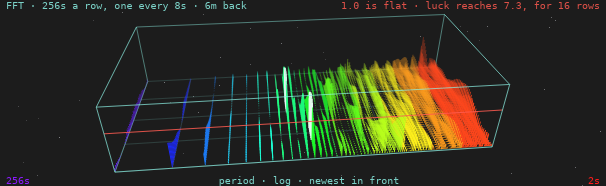

<!-- SPDX-License-Identifier: MIT — Copyright (c) 2026 Paul Richeson -->

# The waterfall

**A short-time Fourier transform of a Geiger counter, kept a row at a time:
what the accumulated spectrum throws away, which is when.**

*A lab report in the IEEE style, on the FFT graph `radbeeper-gui` draws under
its spectrum. Written against radbeeper 0.5.0, 29 September 2026. Every
figure in it was measured on the day, either on the bench's two counters or
on simulated counts, and says which.*



---

## Abstract

RadBeeper already looks for anything arriving on a schedule, with a power
spectrum averaged over every window it has ever taken. Averaging is how a
faint period is found and how its *time* is lost: a line that was present for
ten minutes an hour ago and one that has been present all along come out as
the same bar. This report describes the second view that was added beside
it. Each 256-second window's periodogram is kept as a row of its own; a row
is taken every 8 seconds; the newest 48 are drawn one behind another in a
box seen in perspective from a camera that does not move. The picture spans
**6 minutes 16 seconds of rows, made from 10 minutes 32 seconds of counts**,
and resolves periods from 2 seconds to 4 minutes 16 seconds. A row on its
own is noise by construction. The report gives the arithmetic of a row, the
flow from the counter's serial port to the pixel, the measured length of the
ridges that chance draws -- 16 rows at most -- and what the view can and
cannot find.

**Index terms** -- short-time Fourier transform, spectrogram, waterfall
display, periodogram, Poisson process, radiation monitoring, perspective
projection.

---

## I. Introduction

### A. The problem

Radioactive decay is a Poisson process and the power spectrum of a Poisson
process is flat. [The spectrum](the-spectrum.md) uses that: it averages
periodograms, the scatter falls as 1/√*N*, and anything periodic -- mains
hum on a tube's supply, a fan carrying a source past, firmware that batches
its reports -- climbs out of a floor that is settling under it.

The average has one number for each period. It cannot say whether the
period is there *now*, whether it came and went, or whether it began when
somebody switched something on. Those are the questions asked of a line
once it has been seen.

### B. What was asked for

The form is the one SETI@home's screensaver made familiar: a glass box on a
dark ground, frequency across the front in the colours of the rainbow,
power as thin spikes standing on the floor, and time running back into the
box [3]. The one instruction beyond that was that the camera must not move.

---

## II. One row

A row is a periodogram of the last `W` = 256 seconds of counts per second,
summed across the tubes. In order:

| Step | What is done | Why |
|---|---|---|
| 1 | Take the newest 256 seconds, *x*₀ … *x*₂₅₅ | a power of two, for a radix-2 transform |
| 2 | Subtract their mean | the DC term is the count rate, which every other number on the panel gives |
| 3 | Multiply by a Hann taper, ½ − ½ cos(2π*i*/255) | a period that does not divide the window would otherwise leak into every bin [2] |
| 4 | Transform: *X* = FFT(*x*) | `analysis::fft`, the same one the spectrum uses |
| 5 | Take \|*X*ₖ\|² for *k* = 1 … 127 | bin *k* is the period 256/*k* seconds; *k* = 0 is DC and *k* = 128 is left out |
| 6 | Divide by the mean of those 127 | so that flat reads **1.0** at any count rate |

Steps 1 to 5 are `Spectrum::add`. The difference is what happens next:
`Spectrum` adds the result into a running total, and `Waterfall` keeps it.

### The parameters

| | Value | In seconds |
|---|---|---|
| Window, `W` | 256 samples | 4 m 16 s |
| Hop, `H` | 8 samples | 8 s |
| Depth, `D` | 48 rows | — |
| Bins in a row | 127 | periods of 256 s down to 2.016 s |
| Spacing of the bins | 1/256 Hz | — |
| Overlap of a row with the one before | 248 of 256 seconds | 96.9% |

---

## III. The flow

This is what happens to a count between the tube and the screen. Each box
is one place in the code.

```text
 two GMC-320s                     each reports the counts of its last second
      │  serial, once a second
      ▼
 radbeeper service                holds the ports, logs, and serves the stream
      │  unix socket, a line a sample: who, when, counts
      ▼
 feed thread (gui)                one per window; replays up to 8 h on attach
      │
      │  samples are summed by WHOLE WALL-CLOCK SECOND across the tubes
      │  when the second closes: sec_sum
      ▼
 ┌─────────────────────────────┐
 │ Waterfall::add(sec_sum)     │  analysis.rs
 │                             │
 │  ring of the last 256 s     │  push the second, drop the oldest
 │  since += 1                 │
 │  if since < 8: nothing      │──────────────► no row this second
 │  else:                      │
 │    mean off · Hann · FFT    │  §II, steps 2 to 4
 │    |X|² of bins 1..127      │  step 5
 │    ÷ their mean             │  step 6
 │    push to the FRONT of     │  the oldest falls off the back;
 │    a deque of 48 rows       │  nothing is copied or moved
 └─────────────────────────────┘
      │  rows (shared, remade only when a row arrives),
      │  made: how many rows ever · age: seconds since the newest
      ▼
 Snapshot, once a second          the same message that carries the rest
      │
      ▼
 Chart::draw                      one canvas: dials, counts, spectrum, this
      │  is (made, age) what was drawn last time?
      ├── yes ──► the kept drawing, as it is
      └── no  ──► Chart::waterfall
                    ground, stars, floor grid, far edges
                    rows OLDEST FIRST:  w = (index + age/8) / 48
                       each bin: foot (u, 0, w) to tip (u, power/12, w)
                       through Camera::project
                    luck line, near edges
```

Three things about it are worth saying.

**The rows are shared, not sent.** A snapshot goes to the interface every
second and the rows change every eighth, so they sit behind a reference
count and are rebuilt only when `add` returns true.

**The drawing is kept.** The canvas is redrawn twelve times a second, because
the needles on the dials move that often. The waterfall is some six thousand
lines and changes once a second, so it is drawn into a `canvas::Cache` that
is cleared only when `(made, age)` changes. The software renderer the window
uses in a virtual machine notices the difference.

**A window that attaches late is not behind.** The service replays what it
holds, the feed runs every second of it through `add`, and the box is full
by the time the first live sample arrives.

---

## IV. How much time it captures

The question has three answers, and they are different numbers.

| What is meant | Arithmetic | Time |
|---|---|---|
| **One row** | `W` | **256 s = 4 m 16 s** |
| **The rows on show**, front to back | (`D` − 1) × `H` = 47 × 8 | **376 s = 6 m 16 s** |
| … as the oldest leaves the box | `D` × `H` = 48 × 8 | 384 s = 6 m 24 s |
| **The counts in the picture** | `W` + (`D` − 1) × `H` = 256 + 376 | **632 s = 10 m 32 s** |

The label on the graph says "6m back", which is the second of these: how
long ago the row at the back was taken. But that row was itself made from
the 256 seconds before it, so the oldest count with any say in the picture
arrived ten and a half minutes ago.

### What that is worth

| | Arithmetic | |
|---|---|---|
| Windows that share no seconds | 632 / 256 | 2.5 |
| Looks that are nearly independent, at half overlap | 376 / 128 + 1 | 3.9 |
| Counts in one row, at the bench's 0.9 a second | 0.9 × 256 | about 230 |
| Counts in the whole picture | 0.9 × 632 | about 570 |
| Until the first row, from a cold start | `W` | 4 m 16 s |
| Until the box is full | `W` + (`D` − 1) × `H` | 10 m 32 s |
| Transforms | one of 256 points every 8 s | — |

Forty-eight rows are therefore **four measurements, not forty-eight**. The
other forty-four are those four seen again as they slide past, which is what
makes a ridge a line rather than four dots, and is also what §V is about.

The taper matters to the first figure. A Hann window weighs the middle of
its 256 seconds fully and the two ends hardly at all, so a row answers
mostly for the two minutes at its centre.

### Against the spectrum it sits under

| | Window | Reach | Keeps the time? |
|---|---|---|---|
| Waterfall | 256 s | 10 m 32 s | yes, to 8 s |
| Spectrum, short | 512 s | everything since it started | no |
| Spectrum, middle | 4096 s | the same | no |
| Spectrum, long | 32768 s | the same | no |

---

## V. Reading it

### A. One spike means nothing

A single bin of a single periodogram of noise is an exponential variable,
and the tallest of 127 stands about ln 127 above the mean. `chance_max`
puts the line at **7.34** for one row, and the graph draws it in red across
the front of the box. A spike that clears it is drawn thicker and nearly
white.

### B. Nor does a short ridge

A row shares 248 of its 256 seconds with the row before. A spike that luck
put in one is in its neighbours too, so chance draws ridges of its own. How
long was measured, on simulated Poisson counts with nothing periodic in
them, 400,000 seconds at each of two rates:

| Rate | Runs over the line | Median | 90% within | 99% within | Longest |
|---|---|---|---|---|---|
| 0.45 counts/s | 460 | 5 rows | 9 rows | 13 rows | 16 rows |
| 0.90 counts/s | 521 | 5 rows | 9 rows | 13 rows | 15 rows |

And of boxes of 48 rows, how many held a run that long in any bin:

| A run of at least | 8 rows | 16 rows | 24 rows |
|---|---|---|---|
| Share of boxes, 0.45/s | 8.1% | 0.1% | none |
| Share of boxes, 0.90/s | 8.6% | none | none |

So the rule is **sixteen rows**, half a window, a third of the way back into
the box: a bright line shorter than that is what noise looks like here, and
one longer is not. It is `Waterfall::chance_rows`, it is on the graph's
label, and `luck_draws_short_ridges_and_no_long_ones` holds the code to it
over eleven hours of scrambled counts.

### C. What it finds

A source with a period of 8 seconds was added to a background of 0.9 counts
a second, 200,000 seconds at each strength:

| Source, as a share of background | Its bin reads | Rows over the line | Whole box over |
|---|---|---|---|
| 50% | 6.8 | 39% | 1% |
| 20% | 2.3 | 2% | none |
| 10% | 1.3 | none | none |

This is the honest limit. The waterfall sees a period that is **strong**,
and says when it was there. A faint one it does not see at all: at a fifth
of background the bin reads 2.3 and the line is at 7.3. Finding the faint
one is what averaging is for, and the spectrum above it does that; the two
are not rivals.

The unit test uses a source far stronger than any of these -- a swell that
rises and falls by four counts every eight seconds, on a background of one
and a half -- so that every row of 48 is loudest in bin 31 and over the line
there.

---

## VI. The drawing

There is no 3D engine. There is a rotation, a division and an order.

**A point** is `u` across, `v` up and `w` back, each from 0 to 1. It is
scaled into a box, turned about the vertical by the yaw ψ, tilted about the
horizontal by the pitch θ, and divided by its distance:

```text
 x, y, z  =  (u − ½)·A,  (v − ½)·B,  (w − ½)·C        the box: A × B × C
 x, z     =  x cos ψ − z sin ψ,   x sin ψ + z cos ψ    turn
 y, z     =  y cos θ + z sin θ,   z cos θ − y sin θ    tilt
 screen   =  origin + scale · (x, −y) / (R + z)        perspective
```

The division is the whole of perspective: what is further away is smaller
and closer together.

**The camera does not move.** ψ = 0.10 rad (6°), θ = 0.55 rad (32°) and
*R* = 6 are constants in the source, and nothing writes to them. The box is
as wide as the panel allows, 0.9 high and 2.0 deep, and is scaled once to
fit the room it is given. A turn of 17° was tried first and rejected: the
box is three times as wide as it is deep, and at that angle its far end rose
a whole box-height up the screen.

**Across** is the period on a logarithmic axis, long on the left, as the
spectrum above it has it: `u` = ln *k* / ln 127. The colour runs from violet
at 256 s to red at 2 s and says *where*, not how loud. A spike seen over
forty others has lost its foot; its colour still says which period it
stands on.

**Up** is power, with 12 at the lid, so the luck line sits at six tenths of
the height.

**Back** is age. A row's place is `w` = (index + age/8) / 48, where `age` is
the seconds since the newest row. So the stack moves back an eighth of a row
each second and the new row arrives into the gap it has made. Nothing is
copied to make it move: a row's depth is its index.

**The order** is the painter's: the oldest row first and every newer one
over it. The floor and the far edges of the box go down before the rows and
the near edges after them, which is what puts the spikes inside the glass.
Rows fade with distance, alpha = 1 − 0.7 `w`.

**The labels are not in the canvas.** A canvas here cannot hold text, so
they are widgets in a column laid over it. The column and the canvas are cut
by the same arithmetic (`regions`), which a test holds them to.

### Where it differs from what was described

| Described | Built | Why |
|---|---|---|
| A slide between rows, every frame | A step each second | the window has no timer of its own; a snapshot a second is its only beat |
| HUD panels joined by pipes | Not built | the panel already has its readouts; the graph was what was asked for |
| A starfield | 48 fixed points | they are where they were last time |
| Near-white tips | The same, on a dark ground in both skins | a rainbow on paper is mostly yellow that cannot be seen |
| Drawn at any size | Only in a window 640 high or more | under that the counts and the spectrum keep the panel |

---

## VII. What the bench showed

The first picture taken of it, on the bench's two counters, had a bright
patch near the 2-second end. It was measured rather than believed: a
program attached to the service, took the 6168 seconds it replayed, and ran
the last 1024 through `Waterfall` three ways.

| Input | Bins over the line in 3 rows or more |
|---|---|
| The two tubes summed | one: period 2.72 s, 8 rows running, tallest 8.0 |
| Tube A alone | none |
| Tube B alone | none |

Eight rows is inside what chance draws (§V.B: eight or nine boxes in a
hundred hold a run that long), and a period that belonged to the room would be in each tube
as well as in their sum. **It is noise**, and it is the example of why the
rule is on the label.

The same run found something that is not noise and is not a period. In those
6168 seconds, one tube delivered two samples inside a single wall-clock
second 41 times and the other 13 times -- a counter's second and the
machine's are not the same second, and now and then two of the first land in
one of the second. Each of those is a second that reads double with a second
beside it that reads nothing. They are rare and not regular, so they raise
the floor a little and draw no line.

---

## VIII. Limitations

1. **One window length.** 256 seconds cannot see a period longer than four
   minutes, and resolves a long one coarsely: the first four bins are 256,
   128, 85 and 64 seconds.
2. **It is the sum of the tubes.** When a tube stops answering, the rate
   halves. The mean is removed from each row, but a step inside a window is
   not a mean, and it puts power into the long-period end until the step has
   left the window, four minutes later.
3. **Faint periods are invisible to it**, by §V.C.
4. **The window only.** `radbeeper watch` in a terminal has no waterfall; a
   character cell is too coarse for it.
5. **The slide is a step a second**, not a glide.

---

## IX. Where it is

| | |
|---|---|
| `src/analysis.rs` | `Waterfall`, `chance_max_of`, and four tests: a ridge in every row, no ridge in noise, how long luck's ridges run, nothing before a window |
| `gui/src/main.rs` | `FALL_*` constants, `regions`, `Camera`, `fall_u`, `fall_colour`, `Chart::waterfall`, and three tests |
| Root crate's dependencies | unchanged: `libc` |

---

## References

[1] P. D. Welch, "The use of fast Fourier transform for the estimation of
power spectra: a method based on time averaging over short, modified
periodograms," *IEEE Trans. Audio Electroacoust.*, vol. AU-15, no. 2,
pp. 70–73, 1967.

[2] F. J. Harris, "On the use of windows for harmonic analysis with the
discrete Fourier transform," *Proc. IEEE*, vol. 66, no. 1, pp. 51–83, 1978.

[3] D. P. Anderson, J. Cobb, E. Korpela, M. Lebofsky and D. Werthimer,
"SETI@home: an experiment in public-resource computing," *Commun. ACM*,
vol. 45, no. 11, pp. 56–61, 2002.
